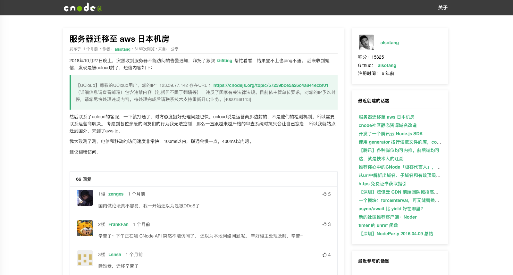

# VueCnodeJS

> 一个 Vue 的**初/中级**练手项目：重构 CnodeJS 社区

[**预览**](https://heuristic-stonebraker-33e1b8.netlify.com/#/)




这是我第一个真正意义上的 Vue 项目，共花了５天时间，每天大概３,4 个小时左右在这个项目上。除了`Vue.js`概念比较了解外，`Vue-Router`和`Axios`都是现学现用。之前还想着可能要花点时间学下新东西，但看了文档后才发现其实挺简单的...

```bash
PS: 如果你想入门Vue,但苦于没有难度合适的项目的话，Here For You!

考虑到别人可能会看我源码来学习Vue，我添加了"非常详细的注释"。贴心吧，嘻嘻～
```
**2018-12-25:** 最近学了React，然后写了对应的[React.js版](https://github.com/shuiRong/ReactCnodeJS)，希望帮到正在/将要学习React的同学

**2018-12-9:** 重构了项目：界面更美观，代码更优雅。

**2017-9-9:** 我又为本项目写了个[Nuxt.js](https://zh.nuxtjs.org/)的版本.完美解决了 SEO 问题(Vue 这种 MVVM 框架一直被人诟病没有解决 SEO,但是现在我们有了 Nuxt). 代码在`nuxtVersion`文件中. **需要注意的地方我写在了代码注释里**

**2017-5-24：** 如果你看完[Vuex](https://vuex.vuejs.org/zh-cn/)文档，对于如何把它应用到`实际项目`中还是有点茫然的话，那么我为这个项目写了一个 Vuex 版本。就在`vuexVersion`文件中。

---

### 本地运行：


```bash
git clone https://github.com/shuiRong/VueCnodeJS.git
cd VueCnodeJS
npm install // 或者 yarn
npm run serve // 或者 yarn serve
```

PS: 默认用的是 8080 端口。

---

### 技术栈：

[Vue](https://cn.vuejs.org/)

[Vue-Router](https://router.vuejs.org/zh-cn/)

[Axios](https://github.com/axios/axios)

[ElementUI](http://element.eleme.io/)

[CnodeJS API](https://cnodejs.org/api)
